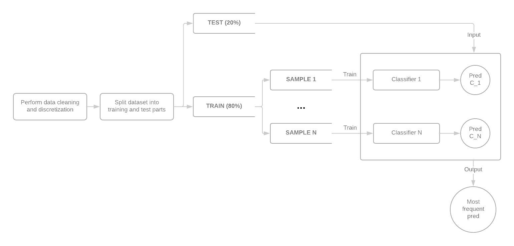

### Introduction
The purpose of this report is to summarize research that we did, the implementation that we committed and the tests that we performed as part of a MOW 2018L course project.

### The algorithm
The main goal of the assignment is briefly summarized in the subject of this paper. We will try to implement a classification model that make its prediction based on a set of internal models - so called ensemble learner. The flow of building and using such a classifier is presented in the picture below.



First datasets will be splitted into training and testing parts. We will probably go with very natural 80 / 20 ratio.

Next we will start building our complex classifier. Depending on the algorithm parameter values, N independent dataset samples will be generated, each of parametrized quantity M. In order to choose observations for samples, simple draw with returning algorithm will be used. For each sample a random subset of K features will be taken. Having all that bootstrapped we will train a model C N times on all prepared sample datasets. The combined classifier will make predictions for all pre-trained models and output the most frequent prediction as the final one.

Various simple internal models can be considered. We will choose just a few simple already implemented packages and integrate them into the core of the algorithm:

* Recursive Partitioning - The algorithm creates a single decision tree, that tries to correctly classify members of the population by splitting it into sub-populations (through each of tree internal nodes) based on several independent variables. However, it does not perform well for continuous data, thus discretization can be needed. The implementation is available as a part of rpart or ctree CRAN packages.
* Naive Bayes - The classifier is based on a simple probabilistic theorem called the Bayesian theorem. An application is based on an assumption that the features of an observation contribute independently to the probability of classifying it to a certain class, regardless of any possible correlations between them. This does not happen very often, so the classifier is likely to not perform very well. The algorithm is implemented in e1071 CRAN package. 

To create models with the *naiveBayes* and *rpart* functions we will only need formula containing arguments to predict from and training data set.

If it will be possible, our implementation will provide an interface for passing metaparameters for its internal models. The space of different parameter values will be evaluated in order to find an optimal combination.

### Data Sets
To do some testing we agreed on using three different data sets available in the UCI repository. They are as follows:

* Cover Type - Data set with information about forests and their surroundings.  Each record belongs to the one of 7 cover types and has 14 attributes like distance to hydrology and roadways, slope in degrees, elevation in meters and soil type. The soil type is determined by 40 binary variables indicating whether the soil belongs to a given class. During the experiment we will consider a conversion of the mentioned columns into one with 40 possible values each dedicated to the one soil type.
* Letter recognition –  describes images of capital Latin letters in 16 numerical attributes (mainly statistical moments) which were scaled into integer values from 0 to 15. We will build models deciding what letter an image contains.
* Default of credit card clients - contains information about bank clients such as gender, education, payment history and bill statement. During the experiment we will predict if a client has a default payment in current month.  The class distribution of given records is not symmetrical(ratio 1:4), we will check whether the aliment of classes proportions in training data improves the models’ effectiveness.

### Other algorithms
As a counterexample we will take some other complex classification algorithms and try to evaluate them on the same data (the same datasets, the same cleaning applied) as we will evaluate our implementation. We will try:

* Bagging (bootstrap aggregating) - ensemble learning method very similar to the one that we are going to implement. We will use ipred CRAN package with following arguments: number of bagging replication and number of sample to draw from the learning sample (if small algorithm uses sampling without replacement). Since this is meta-classification algorithm without any specific kernel defined we can use the same as for our implementation or try some different formulas.
* Random Forest - another ensemble learning method, based on a recursive partitioning kernel. The algorithm builds a lot of different decision trees (constructed with different parameters). Then the classification decision is based on a decision of all the individual submodels. Normally the mean or mode value is taken. The method can perform significantly better that a single tree, since it reduces overfitting. An implementation from randomForest CRAN package will be used with such arguments as farmula, vector indicating which rows belongs to test set, number of arguments that are choose at each split, numbers of trees to grow and maximum number of terminal nodes.

Suppose that we will have our data cleaned and all our algorithms trained, we will need to compare the performance of them. In order to do so we will use two different metrics:
* simple prediction accuracy on a test set value,
* F1-score - harmonic mean of precission and recall values of a classifier from the interval of [0, 1], where 0 means the worst classifier and 1 means the best (in terms of precission and recall). We can consider calculating it with an external package such as MLmetrics, just for simplicity.

### Experiments
```{r}
# install.packages('caret')
# install.packages('rpart')
# install.packages('e1071')
# install.packages('MLmetrics')

library('caret')
library('rpart')
library('e1071')
library('MLmetrics')

# turn off scientific notation
options(scipen = 999)

# load ensemble sources
source('./R/ensemble.R')
source('./R/predict.ensemble.R')
source('./R/onehot.encode.R')
source('./R/train.and.test.R')

# load datasets sources
source('./R/datasets/covtype.R')
source('./R/datasets/default-of-credit-card-clients.R')
source('./R/datasets/letter-recognition.R')

set.seed(1234)

train_and_test_ensemble <- function(df, df_name, ycolname) {
  classifier_funct <- function( data,  nsets, mset, nfeatures, ycolname, xcolnames, formula, submodel_funct, replace, node_size){
      ensemble(
        model = submodel_funct,
        nsets=nsets,
        mset=mset,
        nfeatures=nfeatures,
        ycolname=ycolname,
        data=data)
  }
  # rpart
  rpart_fun <- function(formula, data) rpart(formula, data=data)
  train_and_test(df, df_name, ycolname, 'rpart', clasificator_funct, "source('./R/predict.ensemble.R')", rpart_fun) 
  
  # more complex
  rpart_cms10_ccp1_fun <- function(formula, data) rpart(formula, data=data, control=rpart.control(minsplit=10, cp=1))
  
  train_and_test(df, df_name, ycolname, 'rpart_cms10_ccp1', clasificator_funct, "source('./R/predict.ensemble.R')", rpart_cms10_ccp1_fun, bag_nsets=c(10, 100), bag_nfeatures=c(3, 7)) 
  
  # less complex
  rpart_cms30_ccp0.001_cmd15_fun <- function(formula, data) rpart(formula, data=data, control=rpart.control(minsplit=30, cp=0.001, maxdepth=15))
  train_and_test(df, df_name, ycolname, 'rpart_cms30_ccp0001_cmd15', clasificator_funct, "source('./R/predict.ensemble.R')", rpart_cms30_ccp0.001_cmd15_fun, bag_nsets=c(10, 100), bag_nfeatures=c(3, 7)) 
  
  # naiveBayes
  naiveBayes_fun <- function(formula, data) naiveBayes(formula, data=data)
  train_and_test(df, df_name, ycolname, 'naivebayes', clasificator_funct, "source('./R/predict.ensemble.R')", naiveBayes_fun) 
  
  # natural Laplace smoothing
  naiveBayes_l1_fun <- function(formula, data) naiveBayes(formula, data=data, laplace=1.0)
  train_and_test(df, df_name, ycolname, 'naivebayes_l1', clasificator_funct, "source('./R/predict.ensemble.R')", naiveBayes_l1_fun, bag_nsets=c(10, 100), bag_nfeatures=c(3, 7)) 
  
  # Laplace smoothing with higher alpha
  naiveBayes_l10_fun <- function(formula, data) naiveBayes(formula, data=data, laplace=10.0)
  train_and_test(df, df_name, ycolname, 'naivebayes_l10', clasificator_funct, "source('./R/predict.ensemble.R')", naiveBayes_l10_fun, bag_nsets=c(10, 100), bag_nfeatures=c(3, 7))
  
}
train_and_test_bagging<- function(df, df_name, ycolname) {
  classifier_funct <- function( data, nsets, mset, nfeatures, ycolname,xcolnames, formula, submodel_funct){
      bagging(data=data, formula=formula, nbagg=nsets, ns = mset)
  }
  train_and_test(df, df_name, ycolname, 'bagging', classifier_funct, "library('ipred')")
}

train_and_test_randomforest<- function(df, df_name, ycolname, rpart_funct) {
  randomForest_fun <- function( data, nsets, mset, nfeatures, ycolname, xcolnames, formula, submodel_funct){
    randomForest( x=data[,xcolnames], y=data[,ycolname], ntree=nsets, mtry=nfeatures, sampsize = mset)
  }
  
  train_and_test(df, df_name, ycolname,'randomForest', randomForest_fun,"library('randomForest')")
    
  #minimum node size
  randomForest_ns10_func <- function( data, nsets, mset, nfeatures, ycolname, xcolnames, formula, submodel_funct){
    randomForest( x=data[,xcolnames], y=data[,ycolname], ntree=nsets, mtry=nfeatures, sampsize = mset, nodesize = 10)
  }
  train_and_test(df, df_name, ycolname,'randomForest', randomForest_ns10_func,"library('randomForest')")

  #sampling with replacement
  randomForest_r1_func <- function( data, nsets, mset, nfeatures, ycolname, xcolnames, formula, submodel_funct){
    randomForest( x=data[,xcolnames], y=data[,ycolname], ntree=nsets, mtry=nfeatures, sampsize = mset, replace = 1)
  }
  train_and_test(df, df_name, ycolname,'randomForest', randomForest_r1_func,"library('randomForest')")
}
# letter recognition
lr_df <- load_lr_df()
sapply(lr_df, class)
summary(lr_df)
train_and_test_ensemble(lr_df, 'lr', 'lettr')
train_and_test_bagging(lr_df, 'lr', 'lettr')
train_and_test_randomforest(lr_df, 'lr', 'lettr')

# default of credit card clients
dccc_df <- load_dccc_df()
sapply(dccc_df, class)
summary(dccc_df)
train_and_test_ensemble(dccc_df, 'dccc', 'DEFAULT_PAY')
train_and_test_bagging(dccc_df, 'dccc', 'DEFAULT_PAY')
train_and_test_randomforest(dccc_df, 'dccc', 'DEFAULT_PAY')

# forest cover type
covtype_df <- load_cr_df()
sapply(covtype_df, class)
summary(covtype_df)
train_and_test_ensemble(covtype_df, 'covtype', 'Cover_Type')
train_and_test_bagging(covtype_df, 'covtype', 'Cover_Type')
train_and_test_randomforest(covtype_df, 'covtype', 'Cover_Type')

```

```{r}
# install.packages('tidyverse')
# install.packages('dplyr')
library('tidyverse')
library('dplyr')

# concat all logs
log_filenames <- dir('log') %>% map(function(f) paste0('log/', f))
log_colnames <- c('df_name', 'submodel_name', 'nsets', 'mset', 'nfeatures', 'train_time', 'test_time', 'accuracy', 'f1_score')
log_df <- do.call(rbind, lapply(log_filenames, function(f) read.table(f, header = FALSE, sep = '|', col.names = log_colnames)))

# overall accuracy and f1_score for each model
log_df %>% group_by(submodel_name) %>% summarise(train_time = mean(train_time), test_time = mean(test_time), accuracy = mean(accuracy), f1_score = mean(f1_score)) %>% arrange(desc(f1_score))
```

### References

* https://machinelearningmastery.com/bagging-and-random-forest-ensemble-algorithms-for-machine-learning/
* Ensamble learners
https://www.youtube.com/watch?v=Un9zObFjBH0
* Bootstrap aggregating bagging
https://www.youtube.com/watch?v=2Mg8QD0F1dQ
* Bagging
https://www.youtube.com/watch?v=sVriC_Ys2cw
* Random Forest
https://en.wikipedia.org/wiki/Random_forest 
* Recursive Partitioning
** https://en.wikipedia.org/wiki/Recursive_partitioning
** https://cran.r-project.org/web/packages/rpart/rpart.pdf#rpart
* Naive Bayes
** https://cran.r-project.org/web/packages/e1071/e1071.pdf#naiveBayes
